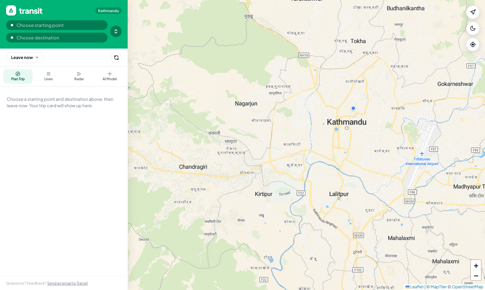
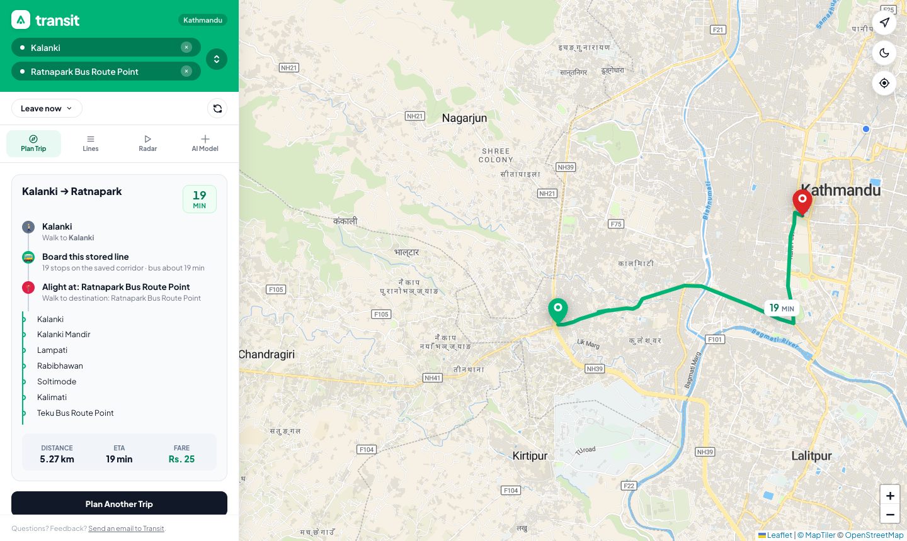
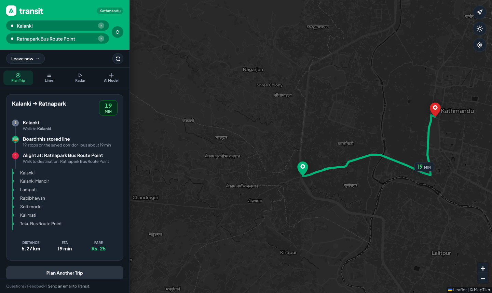
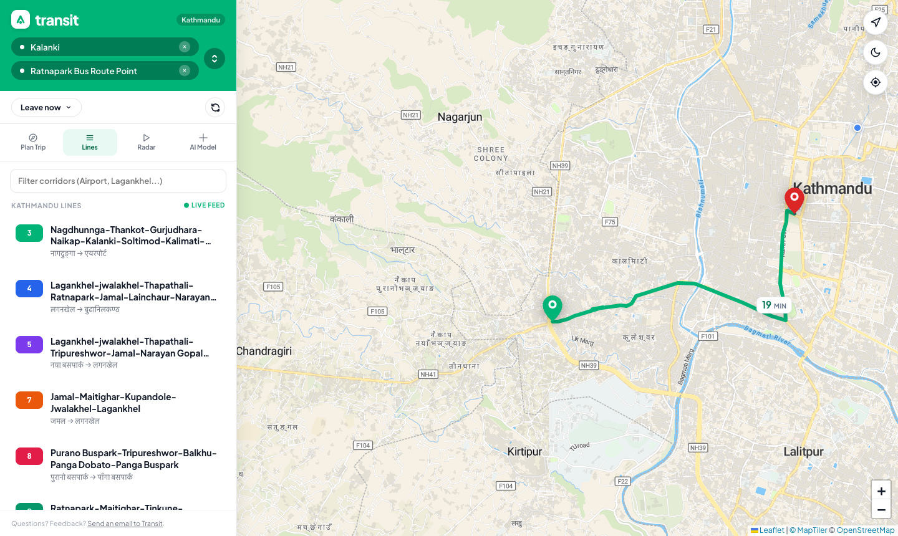
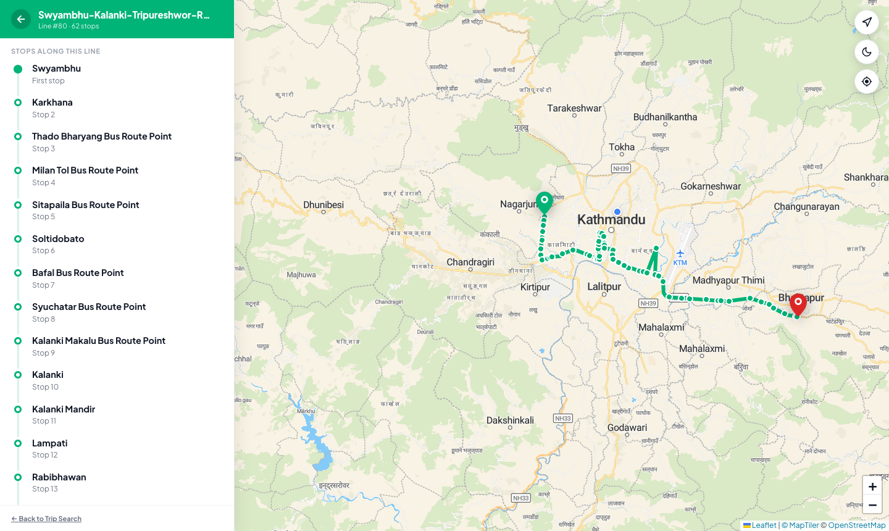
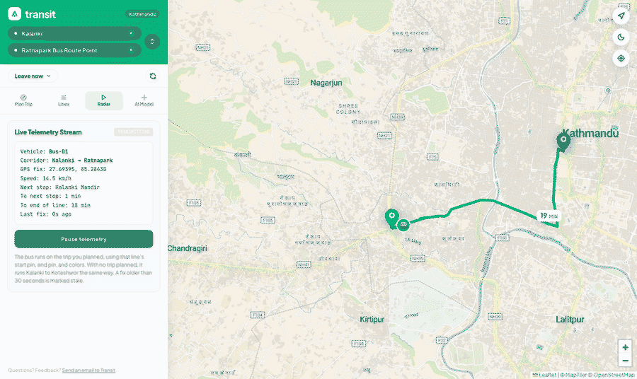
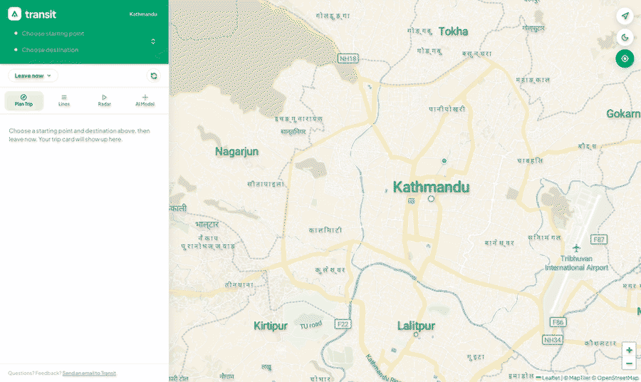
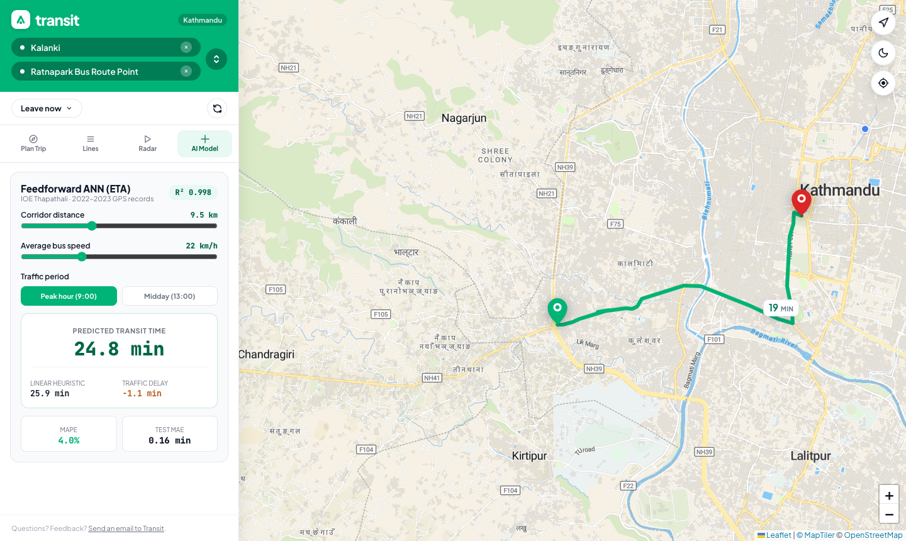
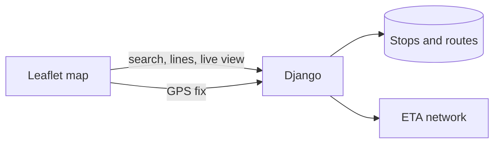
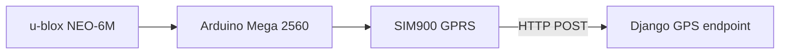

# Public Transportation Assistance using Artificial Neural Network

[](https://www.python.org/)
[](https://www.djangoproject.com/)
[](https://leafletjs.com/)
[](LICENSE)

A Kathmandu transit map for planning a bus trip, browsing stored lines, and watching a bus move along that line. Travel time comes from a neural network trained on 2022–2023 GPS records. Built as a minor project at **Tribhuvan University, Institute of Engineering, Thapathali Campus**.

[Report](https://drive.google.com/file/d/1OQ9E2Be1z1Rs9MlQo7qIhcqWz8Cyc8Of/view?usp=sharing) · [Demo](https://drive.google.com/file/d/1QK_E9o4nTWwKg8LO8D3vSZ7M-Gffb--v/view?usp=sharing)



## What you can do

### Plan a trip

Search two places. The app picks the nearest stored stops, and if they share a saved corridor it draws that line stop by stop: a green pin where you start, a red pin where you finish, gray dashes for the walks, and a green ride. Distance, fare, and ETA sit on the card. Fare is Rs. 20 for the first 5 km, then Rs. 5 for each extra 5 km, measured along the corridor.

Kalanki to Ratnapark is one stored ride: **5.27 km**, **19 min**, **Rs. 25**.



The same trip in the dark theme. The sidebar, cards, and basemap all switch together.



### Browse lines

Lines lists every corridor in the database. Opening one draws its shape and the passenger stops, with the first stop in green and the last in red.





### Live telemetry

Radar plays a bus on the trip you just planned, on the same pins and the same green line. With no trip planned, it runs the saved Kalanki to Tinkune Koteshwor corridor instead. The marker glides along the geometry. A fix older than 30 seconds is marked stale.



A tracker can post coordinates to `POST /api/post_realtime_gps_data/` or `POST /post/<device>/<lat>/<lng>/`. The map reads the latest fix back from that same API.

### Your location

The location button flies to your position at zoom 16 and keeps a blue dot on the map. A later route frame will not pull the camera away from that click.



### ETA model

The AI tab runs the same network as Plan Trip. Move the distance, speed, and hour, and it returns minutes. The badge and the error chips are this training run’s holdout, not a hardcoded score.



## How the site is put together



Plan Trip and Lines read the seeded stop and route tables. Each hop’s minutes come from `ml/weights/eta_ann.joblib`. Live telemetry writes one current position per device and keeps a history row for the speed between fixes.



That second diagram is the tracker from the project: a GPS module, an Arduino Mega, and a SIM900 posting coordinates. Wiring is in [`firmware/PINOUT.md`](firmware/PINOUT.md). The sketch is [`firmware/gps_tracker_mega.ino`](firmware/gps_tracker_mega.ino).

## ETA network

The served model is a scikit-learn network with two hidden layers, 64 and 32 units, trained by [`ml/export_eta_model.py`](ml/export_eta_model.py) on [`data/updated_eta_dataset_BA.csv`](data/updated_eta_dataset_BA.csv).

Each hop uses five inputs: current stop index, next stop index, hour, distance in kilometres, and speed. The target is travel time in minutes. Rows with impossible speeds or times are dropped before training. On an 80/20 holdout of the cleaned table:

| Metric | This training run |
| --- | --- |
| Average error | 0.16 min |
| MAPE | 4.0% |
| R² | 0.998 |

The project report’s Table 6-1 published a different score, R² 0.965 and MAPE 6.74%, from an earlier notebook pass on scaled targets. The site shows the holdout above.

Retrain and replace the weights with:

```bash
python ml/export_eta_model.py
```

[`ml/train_eta_ann.py`](ml/train_eta_ann.py) is the earlier TensorFlow training script. The web app loads the scikit-learn file, not a Keras model.

## Run it locally

Django 4.2 runs on Python 3.10, 3.11, or 3.12.

```bash
git clone https://github.com/harijoshi07/public-transport-assistant-ann.git
cd public-transport-assistant-ann

python3.12 -m venv venv
source venv/bin/activate
pip install -r requirements.txt

cd backend
cp ../.env.example .env
python manage.py migrate
python manage.py insert_stationsinfo
python manage.py insert_routeinfo
python manage.py insert_routeStaioninfo
python manage.py runserver
```

Open [http://127.0.0.1:8000/](http://127.0.0.1:8000/). From the repo root, `./run.sh` starts the same server once the environment and database are ready.

Try **Kalanki** to **Ratnapark**, then open **Radar** and start the stream.

## Repository

```
public-transport-assistant-ann/
├── backend/            Django app, map templates, and GPS ingest
├── data/               Stop, route, and ETA training tables
├── docs/images/        Screenshots and clips in this README
├── firmware/           Arduino sketch and pinout
├── ml/                 Training script and saved ETA weights
├── requirements.txt
└── run.sh
```

## Team

Defended as an academic minor project at the Department of Electronics and Computer Engineering, IOE Thapathali Campus, March 2024.

- **Supervisor:** Er. Kiran Chandra Dahal
- **External examiner:** Er. Yogesh Aryal

- Chandra Mohan Sah (THA077BEI017)
- Hari Krishna Joshi (THA077BEI018)
- Jyotsna Jha (THA077BEI019)
- Khagendra Raj Joshi (THA077BEI022)

## License

MIT. See [LICENSE](LICENSE).
